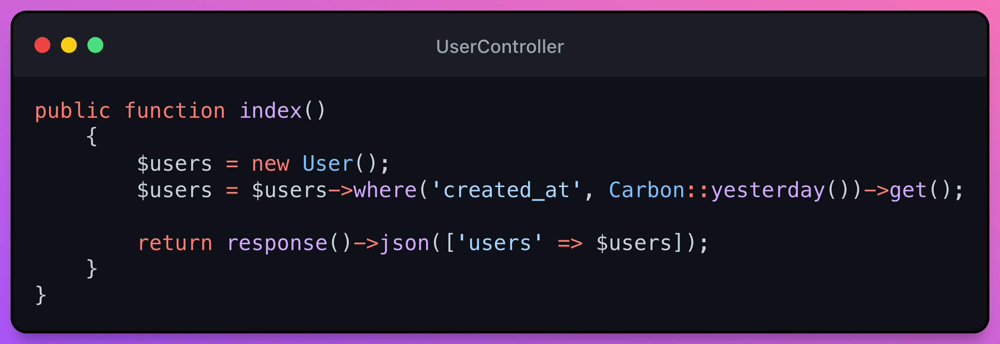

# D - Dependency Inversion Principle (DIP)

I must first make it clear that Dependency Injection is NOT the same as Dependency Inversion. Dependency inversion is a principle, while dependency injection is a design pattern.

> 💡 High-level modules should not depend on low-level ones. Both should depend on abstractions

- How to accomplish
  - Inject dependencies (parameters received in constructor).
  - Rely on the interfaces (contracts) of these dependencies and not on specific implementations.
  - LSP as a premise.
- Purpose or gain:
  - Facilitate the modification and replacement of implementations.
  - Better class testability

The principle of dependency injection tries to maintain a low coupling.

## Laravel controller example
Let's say we have a `UserController`. What in its index method what it does is return a `JSON` list of users with the users created the previous day.

### Laravel controller - DIP Violation 👎

This code wouldn't be bad, because it would clearly work. But at the same time it would generate the following problems:

- ***We cannot reuse the code*** as we are tied to Eloquent.
- ***It is difficult to test*** the methods that instantiate one or several objects (high coupling), since it is difficult to verify that it is failing.
- ***It breaks the principle of single responsibility***, because, in addition to the method doing its job, it also has to create the objects in order to do its job.

### Laravel controller - Following the DIP 👍

As we can see, all classes implement the `UserRespositoryInterface` interface. And this gives us the freedom to get the users either from Eloquent, fromSQL or from a CSV 👏😲 file.

This is fine and would work in a normal application, but how do we make the Laravel controller receive that repository in its index method?

The answer is registering the interface with which class it has ***by default***.

In other frameworks like Symfony it can be done using [PHP DI](https://php-di.org/).

