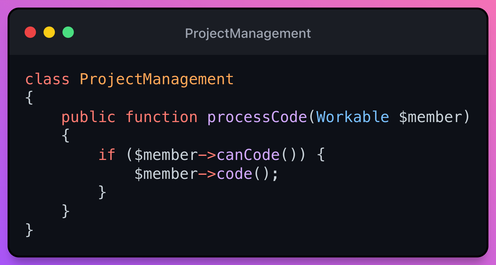

# I - Interface Segregation Principle(ISP)

> 💡 A client should only know the methods they are going to use and not those that they are not going to use.

Basically, what this principle refers to is that we should not create classes with thousands of methods where it ends up being a huge file. Since we are generating a monster class, where most of the time we will only use some of its methods each time. And for that it refers to the need for interfaces, it is also important to understand that this helps a lot at the ***Single Responsibility Principle(SRP)***.

- How to accomplish
  - Define interface contracts based on the clients that use them and not on the implementations that we could have (The interfaces belong to the clients).
  - Avoid Header Interfaces by promoting Role Interfaces
- Purpose or gain:
  - High cohesion and low structural coupling

## Header Interfaces
Martin fowler in the article [HeaderInterface](https://martinfowler.com/bliki/HeaderInterface.html) sustain.

> 💬 A header interface is an explicit interface that mimics the implicit public interface of a class. Essentially you take all the public methods of a class and declare them in an interface. You can then supply an alternative implementation for the class. This is the opposite of a RoleInterface - I discuss more details and the pros and cons there.

## Role Interfaces
Martin fowler in the article [RoleInterface](https://martinfowler.com/bliki/RoleInterface.html#:~:text=A%20role%20interface%20is%20defined,only%20have%20a%20single%20interface.) sustain.

> 💬 A role interface is defined by looking at a specific interaction between suppliers and consumers. A supplier component will usually implement several role interfaces, one for each of these patterns of interaction. This contrasts to a HeaderInterface, where the supplier will only have a single interface.

## Examples
### Simple Example
We want to be able to send notifications via email, Slack, or txt file. What signature will the interface have? 📨

- a) $notifier($content) ✔️
- b) $notifier($slackChannel, $messageTitle, $messageContent, $messageStatus) ❌
- c) $notifier($recieverEmail, $emailSubject, $emailContent) ❌
- d) $notifier($destination, $subject, $content) ❌
- e) $notifier($filename, $tag, $description) ❌

We can rule out that options B, C and E, since Header Interface would be based on the implementation (for Slack, email and file respectively).

In the case of option D, we could consider it invalid given that the type $destination It does not offer us any specificity (we do not know if it is an email, a channel ...).

Finally, in option A, we would only be sending the content, so the particularities of each of the types of notification would have to be given in the constructor (depending on the use case you could not always).

> 👁 The interfaces belong to the clients and not to those who implement them.

### Example Developer | QA | PM - ISP violation due to excess responsibilities and poor abstraction 👎
A simple example would be the following situation. Let's imagine that we have developers, a QA team and a project manager who have to determine whether to program.

Let's say the programmer can program and test, while the QA can only test.

If we pay attention we will see that the `Tester` class has a method that does not correspond to it since it is not called and if it is called it would give us an `Exception`.

So we should make a small refactor to be able to comply with the principle of segregation of interfaces.

### 1 👍
The first thing is to identify what actions we have to perform, design the interfaces and assign these interfaces to the corresponding actors depending on the use case.

This code does comply with the principle of segregation of interfaces. As with the previous principles.

## Design patterns that can be useful to us in the ISP
- [Chain of Responsibility](https://refactoring.guru/design-patterns/chain-of-responsibility)
- [Strategy](https://refactoring.guru/design-patterns/strategy) - [Video](https://youtu.be/v9ejT8FO-7I)
- [State](https://refactoring.guru/design-patterns/state) - [Video](https://youtu.be/N12L5D78MAA)

