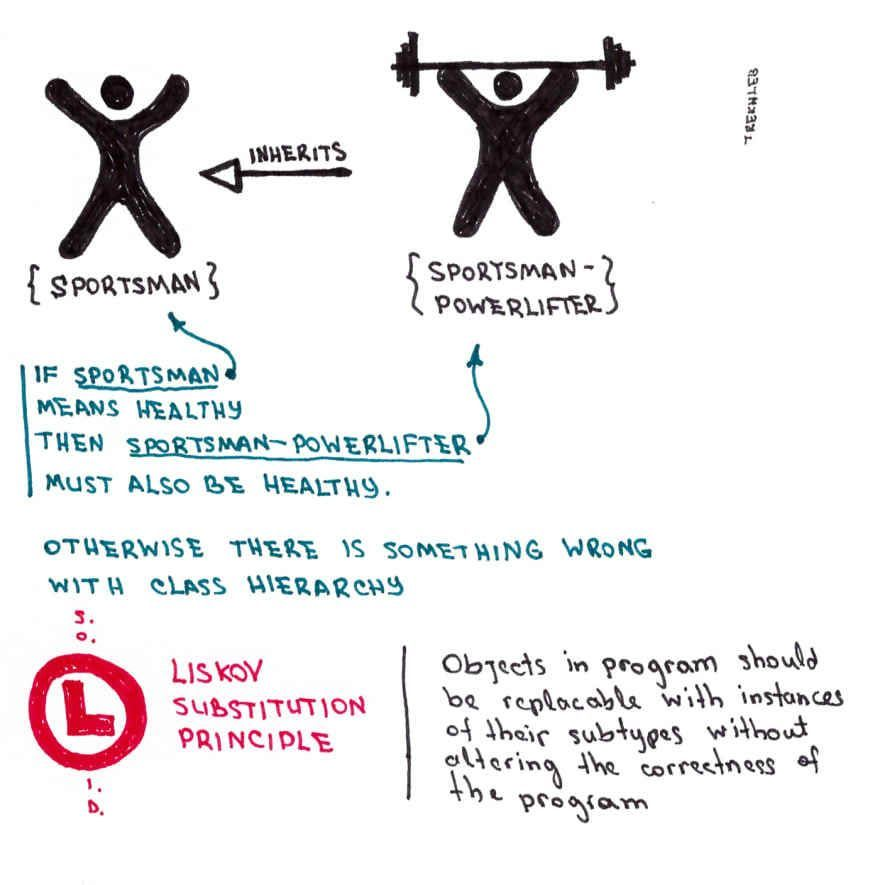
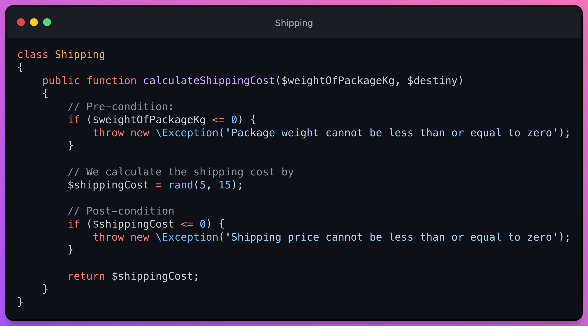
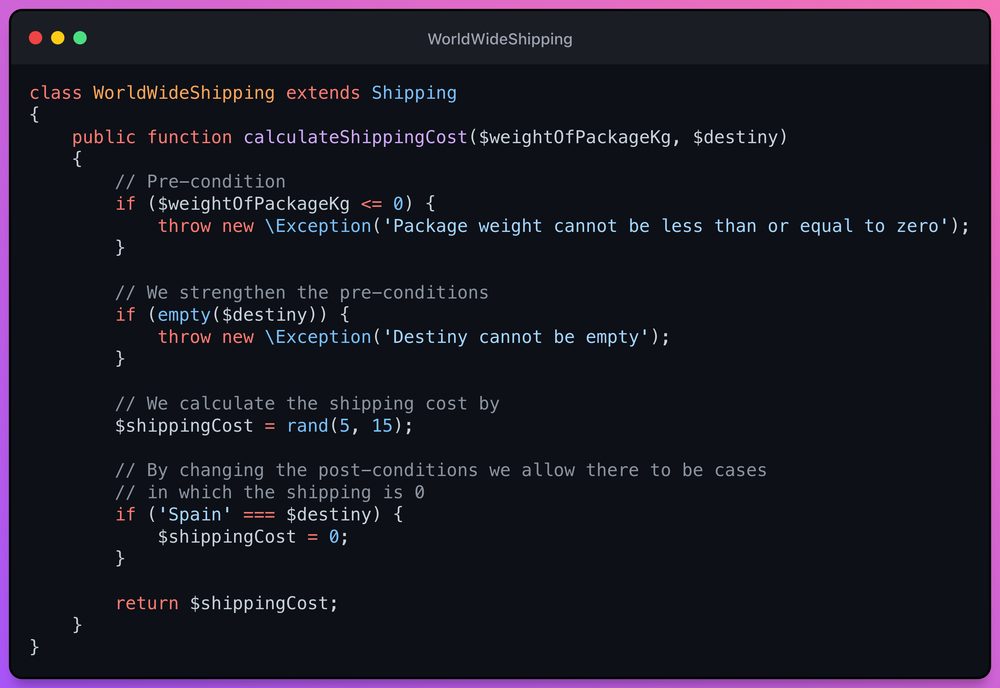
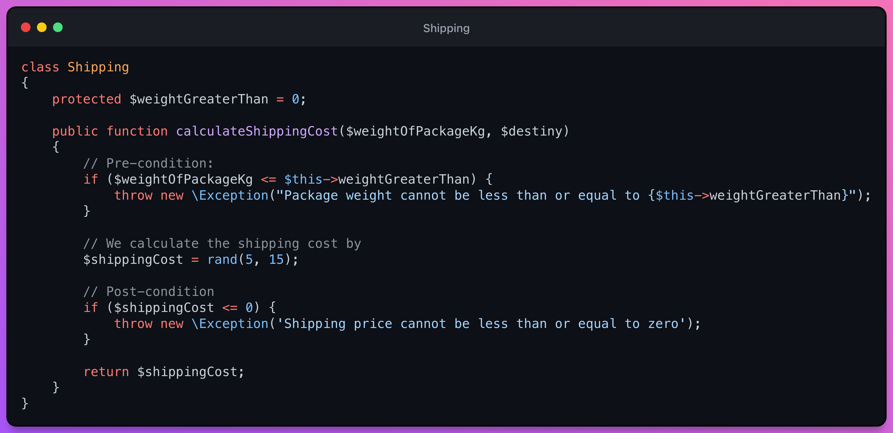
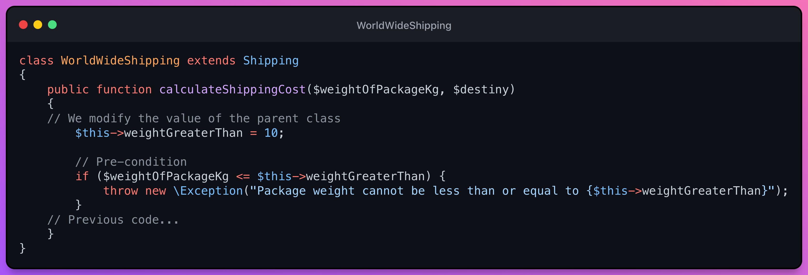
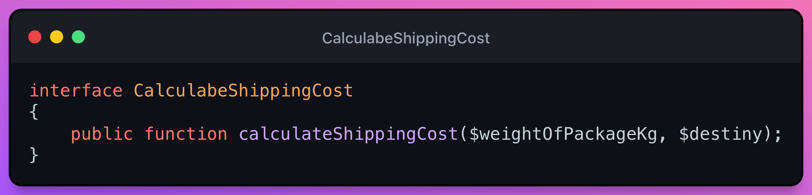
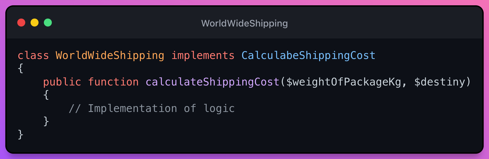

# L - Liskov Substitution Principle(LSP)

This principle was introduced by the guru and the first woman in America to earn a Ph.D. in Computer Science, Barbara Liskov. And it is a very interesting principle.

> According to Wikipedia. Liskov's Substitution Principle says that each class that inherits from another can be used as its parent without having to know the differences between them.

- Concepts:
  - If S is a subtype of T, instances of T should be substitutable for instances of S without altering the program properties, That is, by having a hierarchy it means that we are establishing a contract in the father, so ensuring that this contract is maintained in the child will allow us to replace the father and the application will continue to work perfectly.
- How to accomplish:
  - The behavior of the sub-classes must respect the contract established in the super-class.
  - Maintain functional [correctness](https://en.wikipedia.org/wiki/Correctness_(computer_science)) to be able to apply OCP.

There are 3 important points that we have to keep in mind in order not to violate the ***Liskov*** principle:

- Not to strengthen the pre-conditions and not to weaken the post-conditions of the parent class [defensive programming](https://en.wikipedia.org/wiki/Defensive_programming).
- The invariants set in the base class must be kept in the subclasses.
- Cannot be a method in the subclass that goes against a behavior of the base class. This is called ***Historical Constraint***.

## Example
### Shipping calculation
Let's say we have a Shipping class that is going to calculate the shipping cost of a product given its weight and destination.

### Shipping calculation - LSP violation due to behavior change in daughter class 👎

The problem is that we generate with a class like the previous one is that we are exposing a similar API for programmers, but that has a different implementation.

This class will be the parent class of our example where its method to calculate the shipping price has a pre and a post condition (this way of programming using the pre and post conditions is called Defensive Programming).

For example, a programmer on our team is sure that the `calculateShippingCost()` method, of the `Shipping` class, allows null destination and shipping costs greater than zero, so by wanting to use the WorldWideShipping class, it could cause the system to burst, for example, if you want to use the result of `calculateShippingCost()` in a slice or by giving it a `null` destiny.

Therefore, the WorldWideShipping class is violating the Liskov substitution principle.

### Shipping calculation - LSP violation due to change of invariants from child class 👎

> The [invariants](https://en.wikipedia.org/wiki/Class_invariant) are values of the parent class that cannot be modified by the child classes.

Let's say we want to modify the Shipping class that we had before and we want to make the limit of the weight per kilos be 0 but that it is in a variable.

### Shipping calculation - Following LSP by change of invariants from child class 👍

The easiest way to avoid this would be to simply create the variable `$weightOfPackageKg` as a private constant if our version of ***PHP (7.1.0)*** allows it but by creating that private variable.

## Historical Restrictions

Historical restrictions say that there cannot be a method in the child class that goes against a behavior of its parent class.

That is, if in the parent class there is the `FixedTax()` method, then the `ModifyTax()` method cannot exist in the child class. Or didn't they teach you not to disobey your parents? 😆.

For a method of the subclass to modify the value of a property of the base class is a violation of the Liskov principle because classes must be able to change the value of their properties only (Encapsulation).

## The easiest way not to break the LSP

The best way not to break LSP is by using Interfaces. Instead of extending our child classes from a parent class.

By using interfaces you can implement methods that various classes have in common, but each method will have its own implementation, its own pre and post conditions, its own invariants, etc. We are not tied to a parent class.

> ⚠️ This does not mean that we start using interfaces everywhere, although they are very good. But sometimes it is better to use base classes and other times interfaces. It all depends on the situation.

## Interfaces VS Abstract Classes

- Interface benefits
  - Does not modify the hierarchy tree
    - Allows to implement N Interfaces
- Benefits of Abstract Class
  - It allows to develop the Template Method¹ pattern by pushing the logic to the model. Problem: Difficulty tracing who the actors are and when capturing errors
  - Private getters [Tell-Don't-Ask principle](https://martinfowler.com/bliki/TellDontAsk.html#:~:text=Tell%2DDon't%2DAsk,an%20object%20what%20to%20do.)

***¹. Design pattern Template Method:*** It states that in the abstract class we would define a method body that defines what operation we are going to perform, but we would be calling some methods defined as abstract (delegating the implementation to the children). But beware! 👀 this implies a loss of traceability of our code.

### Conclusion of Interfaces VS Abstract Classes
- ***When do we use Interfaces?:*** When we are going to decouple between layers.
- ***When do we use Abstract?:*** In certain cases for Domain Models ([Domain models](https://en.wikipedia.org/wiki/Domain_model) not ORM models, to avoid [anemic domain models](https://www.martinfowler.com/bliki/AnemicDomainModel.html))

## Design patterns that can be useful to us in the LSP
- [Template method](https://refactoring.guru/design-patterns/template-method) - [Video](https://youtu.be/7ocpwK9uesw)
- [Composite](https://refactoring.guru/design-patterns/composite) - [Video](https://youtu.be/EWDmWbJ4wRA)
- [Strategy](https://refactoring.guru/design-patterns/strategy) - [Video](https://youtu.be/v9ejT8FO-7I)
- [State](https://refactoring.guru/design-patterns/state) - [Video](https://youtu.be/N12L5D78MAA)

