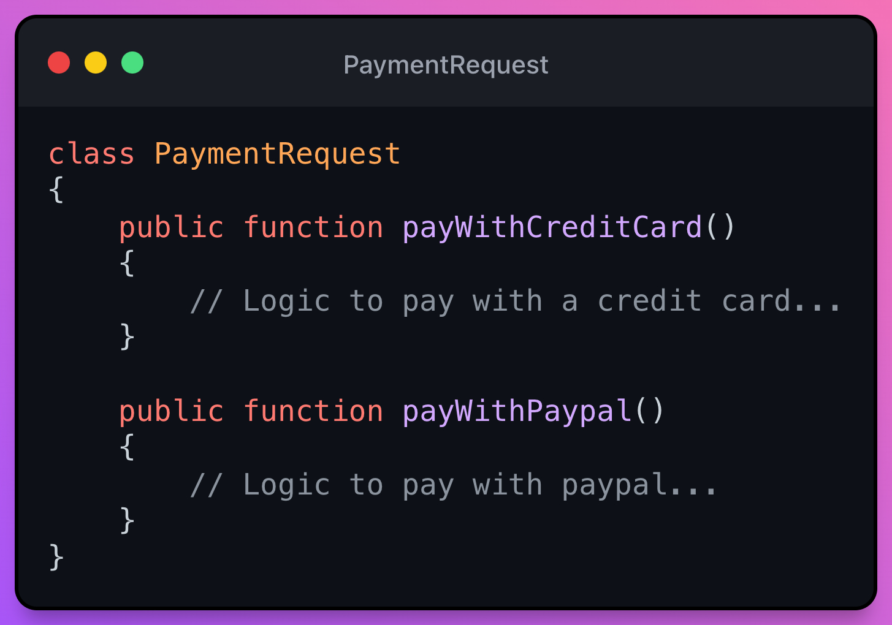
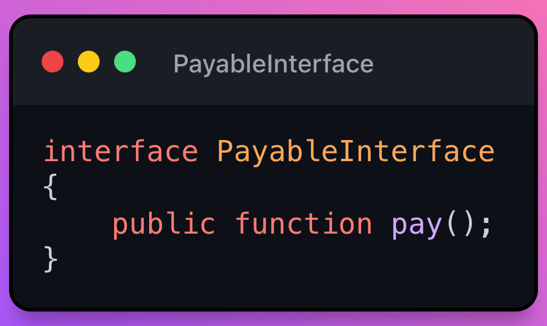

# O - Open-Closed Principle(OCP)

> 💡 Objects or entities should be open for extension, but closed for modification.
- How to accomplish
  - Avoiding depending on specific implementations, making use of abstract classes or interfaces.
- Purpose or gain:
  - Makes it easy to add new use cases to our application

## Examples
Let's imagine that we need to implement a login system. Initially to authenticate our user we need a username and a password (Main use case), so far so good, but what happens if we require or from business require that the user authenticate through Twitter or Gmail?

To begin with, if a situation like this arises, it is important to understand that what is being asked of us is a new feature and not that we modify the current one. And that the case of Twitter would be one use case and that of Gmail another totally different.

### Third Party API Login - OCP Violation 👎

### Login with third party API - Following OCP 👍
The first thing we should do is create an interface that complies with what we want to do and that fits the specific use case.

Now we should decouple the logic that we had already created for our use case and implement it in a class that implements our interface.

As you can see, the LoginService class is agnostic of which authentication method (via web, via google or twitter, etc).

### Payments API implemented with a switch - OCP Violation 👎

A very common case is when we have a `switch()`, where each case performs a different action and there is the possibility that in the future we will continue adding more cases to the switch. Let's look at the following example.

Here we have a controller with a `pay()` method, which is responsible for receiving the type of payment through the request and, depending on that type, the payment will be processed through one or another method found in the Payment class.

This code has 2 big problems:

- We should add one more case for each new payment that we accept or delete a case in the event that we do not accept more payments through PayPal.
- All the methods that process the different types of payments are found in a single class, the Payment class. Therefore, when we add a new payment type or remove one, we should edit the Payment class, and as the Open / Closed principle says, this is not ideal. Like it is also violating the principle of `Single Responsibility`.

### Payments API implemented with a switch - Following OCP 👍
The first thing we could do to try to comply with the OCP is to create an interface with the `pay()` method.

Now we will proceed to create the classes that should implement these interfaces.

The next step would be to refactor our `pay()` method.

> 👁 As you can see, we have replaced the switch with a factory.

## Benefits of the Open / Closed Principle
- Extend the functionalities of the system, without touching the core of the system.
- We prevent breaking parts of the system by adding new functionalities.
- Ease of testing.
- Separation of the different logics.

## Design patterns that we can find useful for OCP
- [Factory](https://refactoring.guru/design-patterns/factory-method/php/example) - [Video](https://youtu.be/EcFVTgRHJLM)
- [Adapter](https://refactoring.guru/design-patterns/adapter) - [Video](https://youtu.be/v-GiuMmsXj4)

