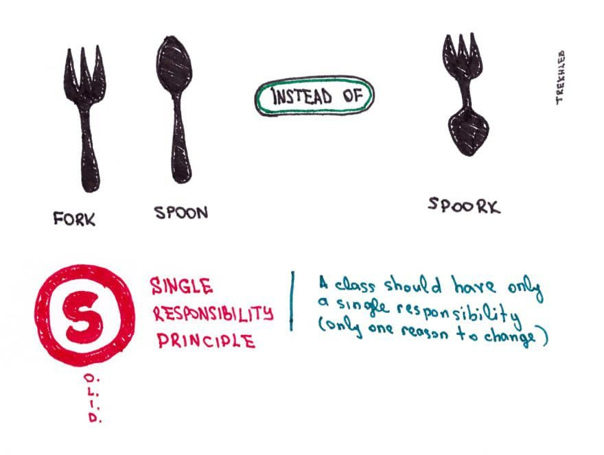
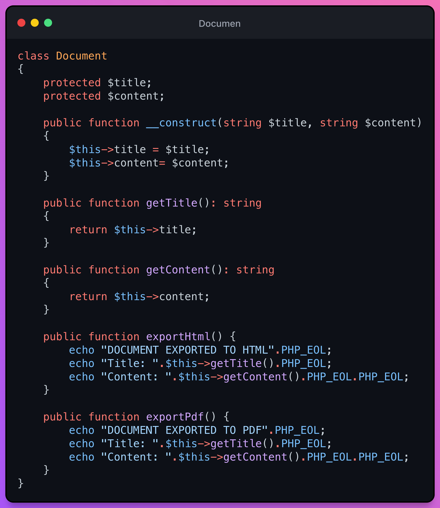
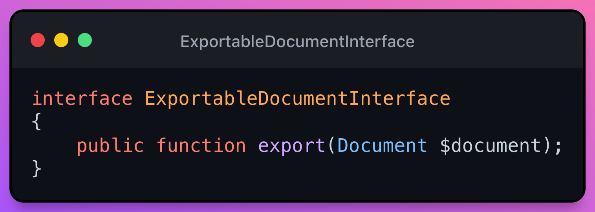
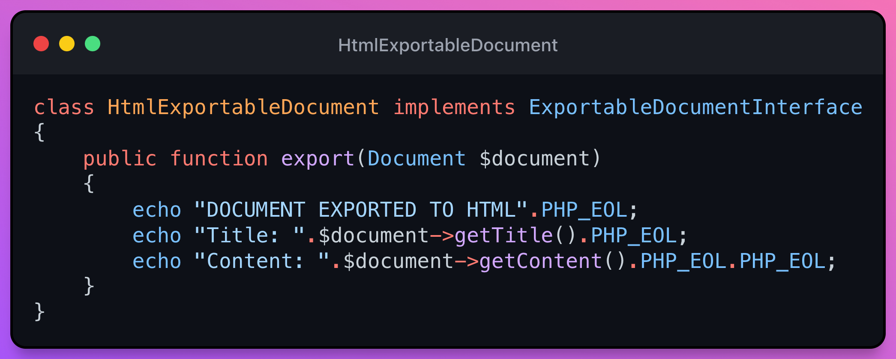
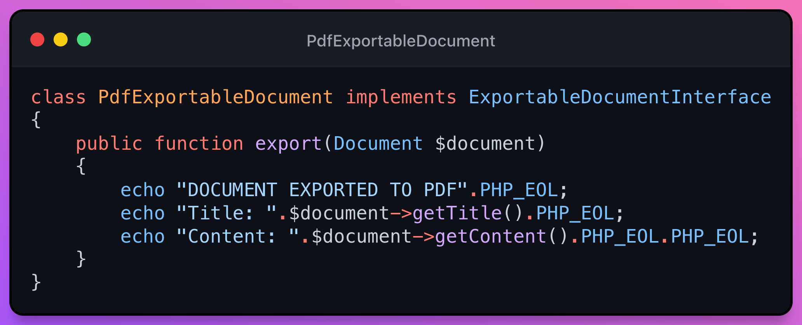
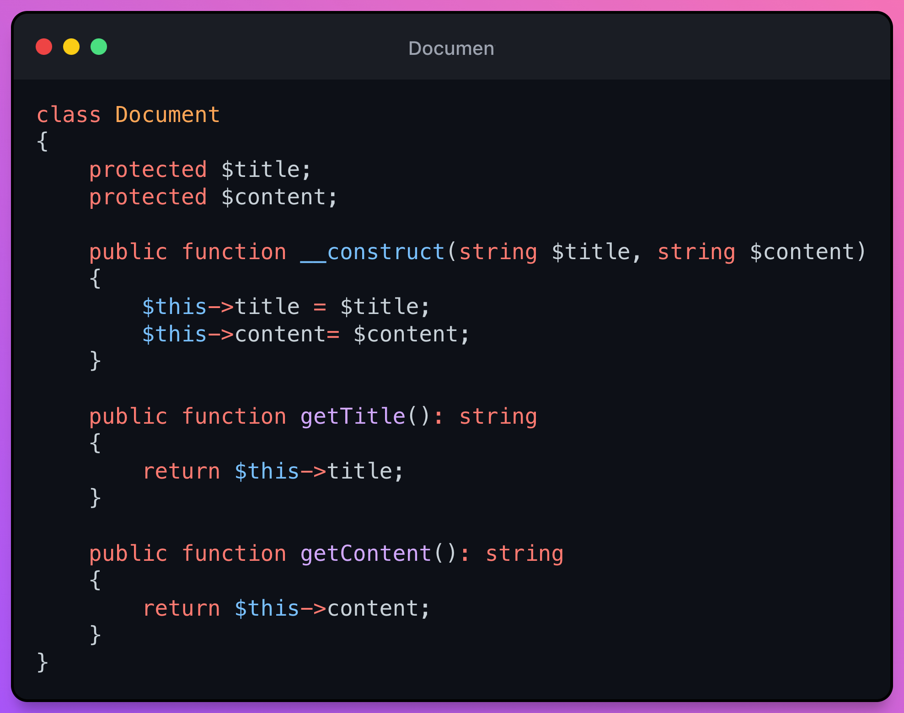

# S - Single Responsibility Principle(SRP)

> 💡 A class should only have one reason to change, which means it should only have one responsibility.

- How to accomplish
    - Small classes with limited objectives
- Purpose or gain:
    - High cohesion and robustness
    - Allow class composition (inject collaborators)
    - Avoid code duplication

## Example
Let's imagine we have a class that represents a text document, said document has a title and content. This document must be able to be exported to HTML and PDF.

### Violation of the SRP 👎
> ⚠️ Code coupled with more than one responsibility

As you may see the methods or functions that we expose as APIs for other programmers to use, include the `getTitle()` and the `getContent()` but these methods are being used within the behavior of the same class.

This breaks the [Tell-Don't-Ask principle](https://martinfowler.com/bliki/TellDontAsk.html#:~:text=Tell%2DDon't%2DAsk,an%20object%20what%20to%20do.)

>💬 Tell-Don't-Ask is a principle that helps people remember that object-orientation is about bundling data with the functions that operate on that data. It reminds us that rather than asking an object for data and acting on that data, we should instead tell an object what to do.

Finally, we also see that the class that must represent a document not only has the responsibility of representing it, but also of exporting it in different formats.

### Following the SRP Principle 👍
Once we have identified that the Document class should not have anything other than the representation of a "document", the next thing we have to establish is the API through which we want to communicate with the export.

For the export we will need to create an interface that receives a document.

The next thing we have to do is extract the logic that does not belong to the class.

Leaving the class implementation something like this

This makes it easier for both the exports and the documentation class to be better tested.
